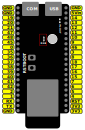
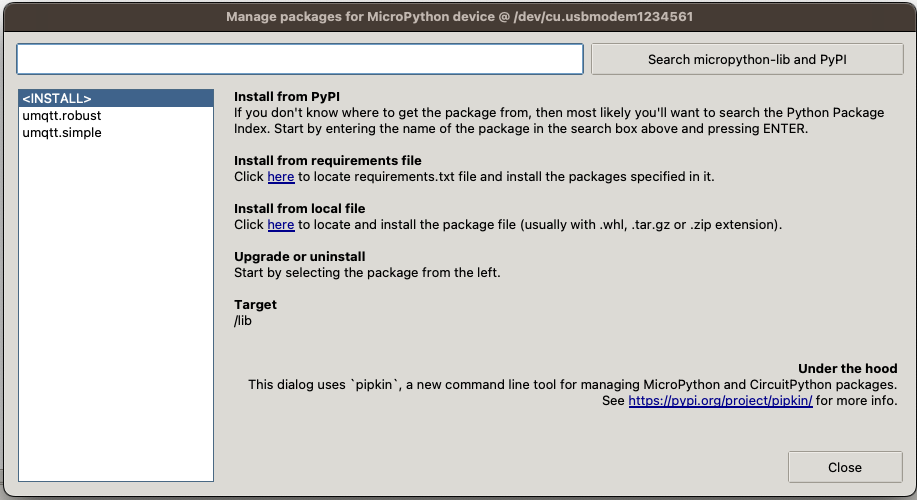

# Indbygget RGB LED på en ESP32S3 med NQTT

## Introduktion

Denne tutorial vil vise, hvordan du sætter en klient på til MQTT som kan styre den indbyggede RGB LED på en ESP32S3 ved hjælp af MicroPython.

På de ESP32S3 boards vi bruger, er den indbyggede RGB LED som er forbundet til `Pin 48`.
Den inbyggede LED er som udgangspunkt koblet fra. For at kunne bruge RGB LED'en, skal der være loddet to kontaktflader sammen på boardet, som vist på billedet nedenfor.

- Hvis det er et nyt board, vil RGB LED'en blinke i forskellige farver, når der stættes en USB ledning til bordet og de to kontaktflader er loddet sammen.



<!-- ### Trin-for-trin guide: -->

```python
import time
import network

SSID = 'frivillig'
PASSWORD = 'test1234'

sta_if = network.WLAN(network.STA_IF)

sta_if.active(True)
sta_if.connect(SSID, PASSWORD)

print(f'Connecting to WiFi {SSID}', end="")
while not sta_if.isconnected():
    time.sleep(1)
    print('.', end="")
```

## 1: Forbind ESP32-S3 til WiFi

1. Forbind din ESP32-S3 til computeren med USB-kablet.
2. I Thonny Shell skriv følgende kommandoer

```python
import network
sta_if = network.WLAN(network.STA_IF)
sta_if.active(True)
sta_if.connect('frivillig', 'test1234')
```

## 2. Installer MQTT klient pakke på ESP32

I Thonny vælg menuen `Tools` og herunder `Manage packages...`. Søg og installer flg. 2 pakker `umqtt.simple` og `umqtt.robust`.

Efterflg. skulle det gerne se således ud:



## 3. Forbind ESP32 til MQTT Broker

Åben en ny fil og brug den nye pakke `umqtt.robust` til at forbinde som klient til MQTT brokeren på Raspberry PI.

```python
from umqtt.robust import MQTTClient

MQTT_BROKER = '192.168.100.129'

CLIENT_ID = 'esp32-test-client'

client = MQTTClient(CLIENT_ID, MQTT_BROKER)

client.connect()

print(f'Connected to MQTT Broker: {MQTT_BROKER}')
```

```python
import time
from umqtt.robust import MQTTClient
from machine import Pin
from neopixel import NeoPixel
import wifi
import random

NAVN = 'skriv-dit-navn-her'

SSID = 'frivillig'
PASSWORD = 'test1234'
MQTT_BROKER = '192.168.100.129'
MQTT_PORT = 1883
MQTT_USERNAME = None
MQTT_PASSWORD = None

CLIENT_ID = f'esp32-{NAVN}-{time.time_ns()}'

INFO_TOPIC = 'info'

wifi.try_connect_to_wifi(SSID, PASSWORD)

client = MQTTClient(CLIENT_ID, MQTT_BROKER, port=MQTT_PORT, user=MQTT_USERNAME, password=MQTT_PASSWORD)

def subscribe(topic, msg):
    topic_name = topic.decode('utf-8')
    message = msg.decode('utf-8')
    print(f'Received message {message} on {topic_name}')

client.connect()
client.set_callback(subscribe)

print(f'Connected to MQTT Broker: {MQTT_BROKER}')

client.subscribe(INFO_TOPIC)

while True:
    client.check_msg()

```

Åben ny MyMQTT på din telefon og connect til brokeren på den samme IP addresse.

Publish en besked til topic `info` og se at den kommer frem til din ESP32 i Thonny - du vil også få alle andres beskeder da i forbinder til den samme broker - det er helt som forventet 😊

**4. Skift onboard LED farve**

Nu vil vi ændre farven på onboard LED alt efter hvad der sendt i den besked vi lytter på. For at gøre det vil vi subscribe til et nyt topic, så hver pirat subscriber til deres eget topic. Der skal så sendes beskeder med en farve som tekst, fx. `red`, `green` eller `blue` og så skal LED skife farve.

Vi kan genbruge koden fra ovenfor og subscribe til det nye topic:

```python
import time
from umqtt.robust import MQTTClient
from machine import Pin
from neopixel import NeoPixel
import wifi
import random

NAVN = 'jesper'

## ESP32 CP network
SSID = 'frivillig'
PASSWORD = 'test1234'
MQTT_BROKER = '192.168.100.129'
MQTT_PORT = 1883
MQTT_USERNAME = None
MQTT_PASSWORD = None

CLIENT_ID = f'esp32-{NAVN}-{time.time_ns()}'

INFO_TOPIC = 'info'
LED_TOPIC = f'led/{NAVN}'

wifi.try_connect_to_wifi(SSID, PASSWORD)

client = MQTTClient(CLIENT_ID, MQTT_BROKER, port=MQTT_PORT, user=MQTT_USERNAME, password=MQTT_PASSWORD)

# Konfiguration af NeoPixel LED
pin = 48  # GPIO 48
num_leds = 1
np = NeoPixel(Pin(pin), num_leds)

def skift_farve(farve):
    print(f'Skifter LED til {farve}')
    color = None
    if (farve == 'red'):
        color = (255, 0, 0)
    elif (farve == 'green'):
        color = (0, 255, 0)
    elif (farve == 'blue'):
        color = (0, 0, 255)
    elif (farve == 'random'):
        color = (random.randrange(180), random.randrange(180), random.randrange(180))
    elif (farve == 'off'):
        color = (0, 0, 0)
    else:
        print(f'Ukendt farve {farve}')
        return

    np[0] = color
    np.write()

def subscribe(topic, msg):
    topic_name = topic.decode('utf-8')
    message = msg.decode('utf-8')
    print(f'Received message {message} on {topic_name}')
    if topic_name == LED_TOPIC:
        skift_farve(message)

client.connect()
client.set_callback(subscribe)

print(f'Connected to MQTT Broker: {MQTT_BROKER}')

client.subscribe(INFO_TOPIC)
client.subscribe(LED_TOPIC)

while True:
    client.check_msg()

```
